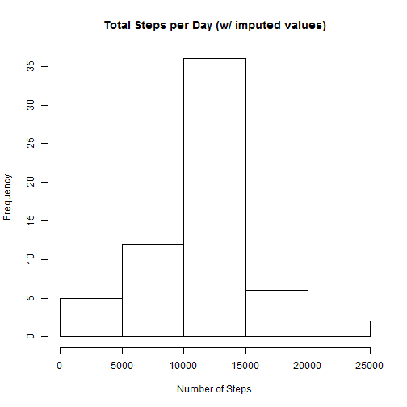

## Loading and preprocessing the data
It is assumed that the 'activity' dataset has been unzipped and is
located in the working directory. It is also necessary to have
previously downloaded the 'dplyr' package, which can be found at
https://cran.r-project.org/web/packages/dplyr/index.html. The
following code will load the 'dplyr' package as well as the
'activity.csv' dataset into R:


```r
data <- read.csv('activity.csv')

library(dplyr)
```

```
## 
## Attaching package: 'dplyr'
## 
## The following objects are masked from 'package:stats':
## 
##     filter, lag
## 
## The following objects are masked from 'package:base':
## 
##     intersect, setdiff, setequal, union
```


## What is mean total number of steps taken per day?

A histogram of the total number of steps taken each day:

```r
data1 <-group_by(data, date)
sum_data1 <-summarize(data1, sum(steps))
steps_per_day<- sum_data1$`sum(steps)`
hist(steps_per_day,main="Total Steps per Day",
     xlab= "Number of Steps")
```

 

Mean of the total number of steps taken each day:

```r
mean (sum_data1$`sum(steps)`,na.rm= TRUE)
```

```
## [1] 10766.19
```

Median of the total number of steps taken each day:

```r
median (sum_data1$`sum(steps)`,na.rm= TRUE)
```

```
## [1] 10765
```


## What is the average daily activity pattern?

Time-series plot of the 5-min intervals and the average number of
steps, averaged across all days in the dataset:


```r
data2 <- group_by(data,interval) 
average_data2 <- summarize(data2, mean(steps, na.rm=TRUE))
plot(average_data2, type="l",main="Average Number of Steps/Interval",
     xlab= "5-min Interval (in Military time)", 
     ylab= "Average Number of Steps" )
```

 

The 5-min interval containing the maximum number of steps averaged
across all of the days in the dataset:

```r
max_steps <-subset(average_data2,(average_data2[2]==max(average_data2[2])))
max_steps[1]
```

```
## Source: local data frame [1 x 1]
## 
##   interval
## 1      835
```


## Imputing missing values
In order to replace the missing values in the dataset, the following
steps have been taken:

First, the total number of missing values has been calculated:

```r
sum(is.na(data))
```

```
## [1] 2304
```

Second, the missing values have been replaced with the mean value of
the number of steps within the 5-min interval averaged across all
days in the dataset. 

```r
im_data <- data.frame()
for(i in unique(data$interval)){
    x <- subset(data,data$interval == i)
    x$steps[is.na(x$steps)] <- mean(x$steps,na.rm=TRUE)
    im_data <- rbind(im_data,x)
}
```

A histogram of the data with imputed values:

```r
im_data <-group_by(im_data, date)
sum_im_data <-summarize(im_data, sum(steps))
steps_per_day_im<- sum_im_data$`sum(steps)`
hist(steps_per_day_im, main="Total Steps per Day (w/ imputed values)",
     xlab= "Number of Steps")
```

 

Mean of the total number of steps taken each day:

```r
mean(sum_im_data$`sum(steps)`)
```

```
## [1] 10766.19
```

Median of the total number of steps taken each day:

```r
median(sum_im_data$`sum(steps)`)
```

```
## [1] 10766.19
```

The above method of imputing values for the missing data does not
change the value of the mean, but it does have an effect on the
median. The median is now reported as being equal to the mean. 


## Are there differences in activity patterns between weekdays and weekends?

Add a column that indicates whether the date falls on a weekday or
weekend:


```r
im_data2 <- arrange(im_data, date)
im_data2 <- mutate(im_data2,weekdays(as.Date(date)))
colnames(im_data2)[4] <- 'Day'
im_data2$Day <- gsub("Monday","weekday",im_data2$Day)
im_data2$Day <- gsub("Tuesday","weekday",im_data2$Day)
im_data2$Day <- gsub("Wednesday","weekday",im_data2$Day)
im_data2$Day <- gsub("Thursday","weekday",im_data2$Day)
im_data2$Day <- gsub("Friday","weekday",im_data2$Day)
im_data2$Day <- gsub("Saturday","weekend",im_data2$Day)
im_data2$Day <- gsub("Sunday","weekend",im_data2$Day)

imd2_weekday <- subset(im_data2, Day == "weekday")
imd2_weekend <- subset(im_data2, Day == "weekend")
```

Panel that contains time-series plots of the 5-min intervals and the
average number of steps, averaged across all days, contrasting
weekday with weekend activity:


```r
par(mfcol=c(1,2))

imd2_weekday <- group_by(imd2_weekday,interval) 
average_imd2_weekday <- summarize(imd2_weekday, mean(steps))
plot(average_imd2_weekday, type="l",
     main= "Avg # of Steps/ Interval (Weekdays)",
     xlab= "5-min Interval (in Military time)", 
     ylab= "Avg # of Steps" )

imd2_weekend <- group_by(imd2_weekend,interval) 
average_imd2_weekend <- summarize(imd2_weekend, mean(steps))
plot(average_imd2_weekend, type="l",
     main= "Avg # of Steps/ Interval (Weekends)",
     xlab= "5-min Interval (in Military time)", 
     ylab= "Avg # of Steps")
```

 


